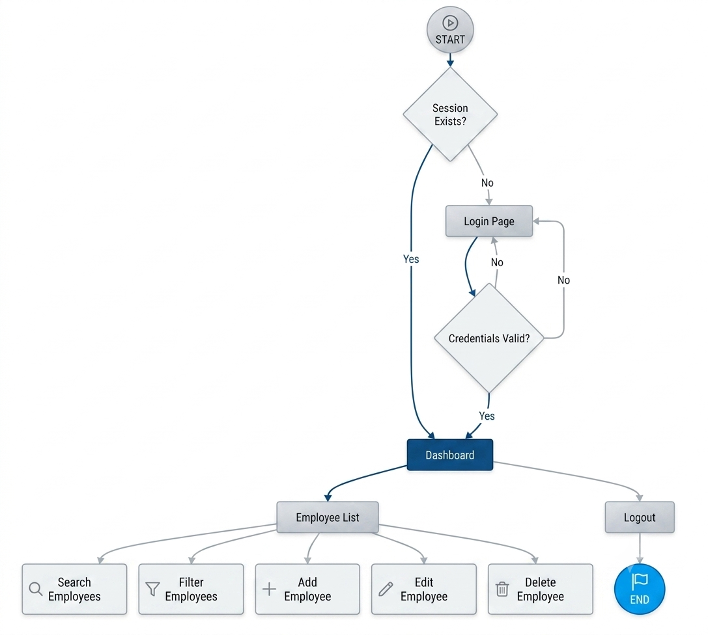
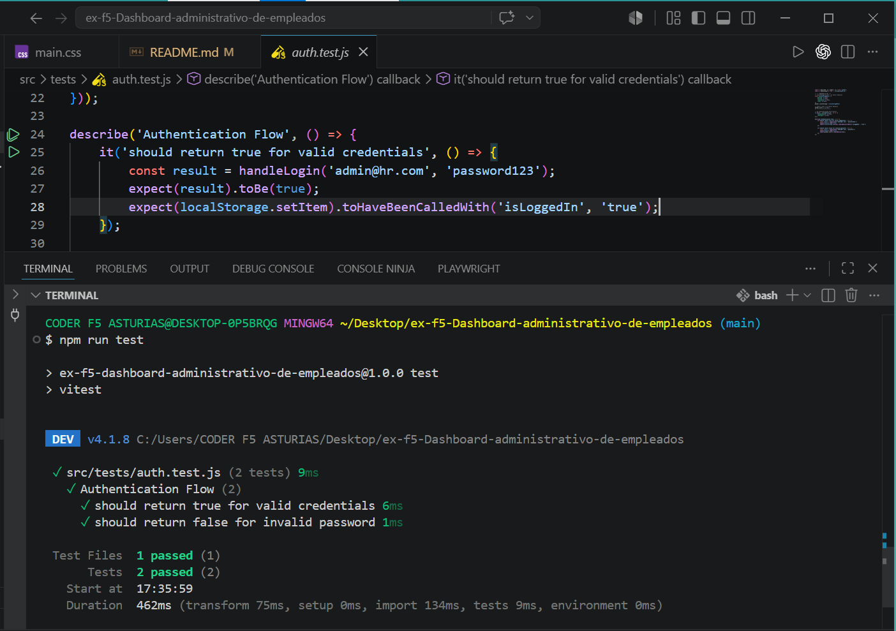
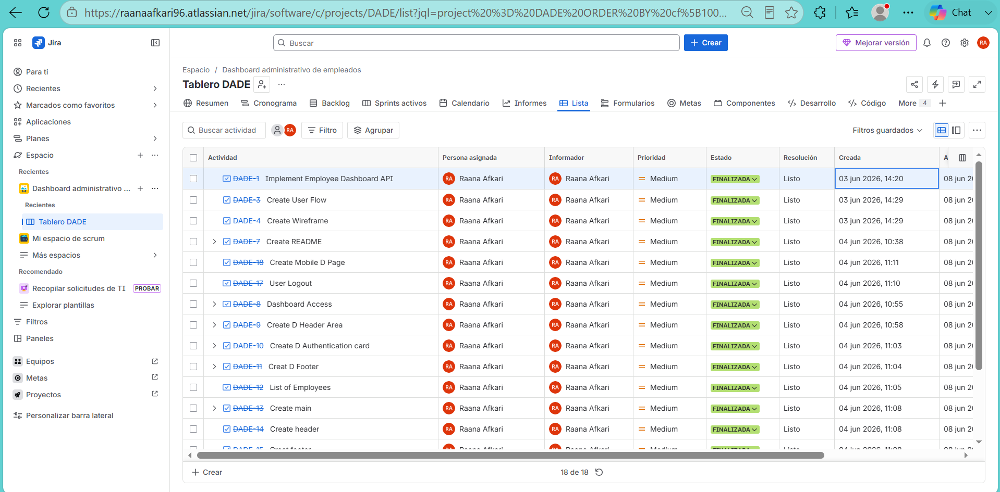

# HR Core Dashboard

## Project Description

HR Core Dashboard is a responsive administrative web application developed to manage employee information. The application allows an administrator to authenticate using email and password, access a protected dashboard, view employee data retrieved from an external API, filter employees, and manage session persistence using localStorage.

This project was developed using HTML5, CSS3, and Vanilla JavaScript following a modular architecture.
Commit Convention: This project strictly follows Conventional Commits (e.g., feat:, fix:, docs:).
---

## Features

* Administrator authentication
* Email validation
* Password validation
* Protected dashboard access
* Employee list retrieved from an external API
* Employee search and filtering
* Add employee functionality
* Edit employee functionality
* Delete employee functionality
* Session persistence with localStorage
* Responsive design for mobile and desktop
* Unit testing with Vitest

## Userflow

The following diagram illustrates the application's user authentication flow and the dashboard navigation logic:



### Logic Overview:
1. **Login / Session Check:** The application checks for an active session in `localStorage`. If it exists, the user is redirected directly to the **Dashboard**.
2. **Dashboard:** The main hub for managing employee data.
3. **Employee List:** Displays the workforce with options for CRUD operations.
4. **Operations:**
   * **Search / Filter:** Dynamically updates the employee list.
   * **Add Employee:** Opens a modal to create new records.
   * **Edit Employee:** Modifies existing employee details.
   * **Delete Employee:** Removes a record from the list.
5. **Logout:** Terminates the session and redirects the user back to the login page.

---

## Technologies Used

* HTML5
* CSS3
* JavaScript (Vanilla)
* Fetch API
* LocalStorage
* Vitest
* Git & GitHub
* GitHub Pages
* Jira
* Figma

---

## API

Employee data is retrieved from:

https://jsonplaceholder.typicode.com/users

Displayed employee information:

* Name
* Email
* Street
* Suite
* City
* Zipcode

---

## User Stories

### User Story 1 - Login

As an administrator

I want to log in using my email and password

So that I can access the employee management dashboard.

### User Story 2 - Employee List

As an authenticated administrator

I want to view employee information

So that I can manage employee records.

### User Story 3 - Employee Filtering

As an authenticated administrator

I want to filter employees by the first letter of their name

So that I can quickly find specific employees.

### User Story 4 - Logout

As an authenticated administrator

I want to log out of the application

So that my session remains secure.

---

## Acceptance Criteria

### Login

* Valid email format is required
* Password must contain at least 8 characters
* Password must contain at least one number

### Dashboard

* Dashboard is only accessible after authentication
* Employee data is loaded from the API

### Session Management

* User session is stored using localStorage
* Active sessions automatically redirect to the dashboard
* Logout clears the session

### Responsive Design

* Application works correctly on desktop devices
* Application works correctly on mobile devices

---

## Installation

Clone the repository:

```bash
git clone YOUR_REPOSITORY_URL
```

Navigate to the project folder:

```bash
cd hr-core-dashboard
```

Install dependencies:

```bash
npm install
```

Run the project:

```bash
npm run dev
```

Run tests:

```bash
npm run test
```

---

Testing

Unit tests were implemented using Vitest to verify the authentication flow.

Tested Scenarios
Successful login with valid credentials.
Failed login with an invalid password.
localStorage session persistence behavior.
Test Results

The project currently includes authentication tests that execute successfully.
Add a screenshot of the Vitest execution here:


---

## Project Planning

Project planning and task management were performed using Jira.

The board includes:

* Sprint planning
* User stories
* Tasks and subtasks
* Due dates
* **Jira Board:** [Access the Project Board Here](https://raanaafkari96.atlassian.net/jira/software/c/projects/DADE/boards/67/backlog)



---

## Prototype

Figma prototype:

(https://www.figma.com/design/GA7mYxvbjo0bOtCMh727Bh/Employee-Dashboard?node-id=5-408&t=hbt84snonvCmgHoz-1)

---

## Deployment

GitHub Pages:

( https://raana-1375.github.io/ex-f5-Dashboard-administrativo-de-empleados/)

---

## Authors

* Rana Afkari
